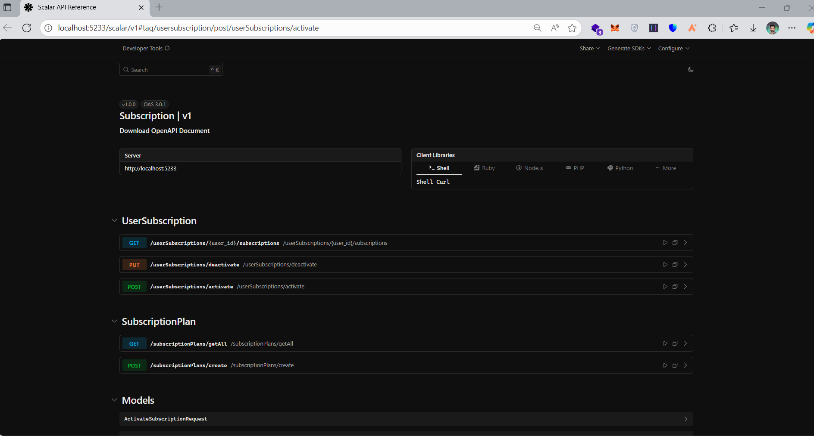

# Subscription
Subscription system based on Asp.net core 9 on VSA

# 1. Why did you choose this structure and these technologies ?

I implemented the web services using .NET 9 with a RESTful architecture. For better performance and simplicity, I used Minimal APIs, which demonstrated noticeably higher efficiency compared to the traditional controller-based approach. However, in enterprise-level applications, I still prefer using controllers for Web APIs because they offer better structure and flexibility for more complex scenarios.

.NET 9 has shown excellent performance, speed, and stability in recent years. Its cross-platform support also makes it an ideal choice for developing modern and scalable applications.

For the application architecture, I adopted the Vertical Slice Architecture, which follows a feature-based structure. This approach ensures high cohesion within each slice and low coupling between slices, allowing for a more organized, maintainable, and business-focused design. It also makes understanding the domain logic and adding new features much easier.

For data access, I used Entity Framework Core (EF Core) as the ORM. EF Core offers strong performance, seamless integration with .NET, and excellent support for relational data, fully meeting the project’s needs.

Regarding the database, I chose Microsoft SQL Server as the relational database system since there was no particular need for a NoSQL database in this task. In my opinion, SQL Server  along with other relational systems like PostgreSQL  is a solid and reliable choice for this kind of project.

I intentionally avoided using the Repository Pattern and Unit of Work Pattern because I wanted to keep the project simple. As you may know, these patterns are often considered anti-patterns in modern EF Core applications, since EF Core’s DbContext already provides similar functionality by managing the unit of work and repository responsibilities internally. While these patterns still have valid use cases for abstraction and adhering to the Dependency Inversion Principle (DIP), in this case, I found them unnecessary.

Additionally, I didn’t use AutoMapper or similar libraries because the project’s scale didn’t require it. Instead, I preferred to perform manual mapping, which kept the implementation straightforward and transparent. However, for scenarios involving more complex model to DTO or JSON mappings, I do recommend and use mapping solutions whether manual mapping or tools like AutoMapper, Mapster, and similar libraries depending on the project’s complexity and requirements.

# 2. If the project were implemented on a large scale, what changes would you make?

If the project were implemented at a larger scale, I would focus on enhancing performance, scalability, and data consistency across the system.

For better read performance, especially when retrieving subscription lists, I would use caching mechanisms to minimize unnecessary database queries and improve response times. Depending on the scenario, I would also apply database indexing to optimize filtering operations on frequently queried fields.

Since this subscription service is designed to interact with payment and wallet services, we must pay special attention to concurrency management and idempotency to ensure data integrity and avoid issues such as duplicate transactions or inconsistent states during high traffic. These aspects are properly handled and enforced within the respective services to maintain reliable and consistent operations across the system.

Additionally, if the subscription service needs to communicate with other services, it’s essential to carefully design inter-service communication and implement compensation (rollback) scenarios to maintain system resilience and fault tolerance in the event of partial failures or network disruptions.

To ensure scalability, the service can be deployed in multiple instances behind a load balancer, distributing incoming requests evenly across instances. This setup allows the system to handle higher loads efficiently, maintain high availability, and deliver faster response times under heavy traffic.

# 3. How much time did you spend completing the task?

15:40 PM - 21:20 PM => 5 Hours - 40 Min

# 4. In which areas have you used artificial intelligence (AI) for code generation or assistance?

In this project, I specifically leveraged AI to write validation messages for DTOs
In general, I use AI tools in coding to handle routine tasks, such as writing common utility methods like date conversion, which helped improve efficiency and allowed me to focus on more complex or critical parts of the system.

